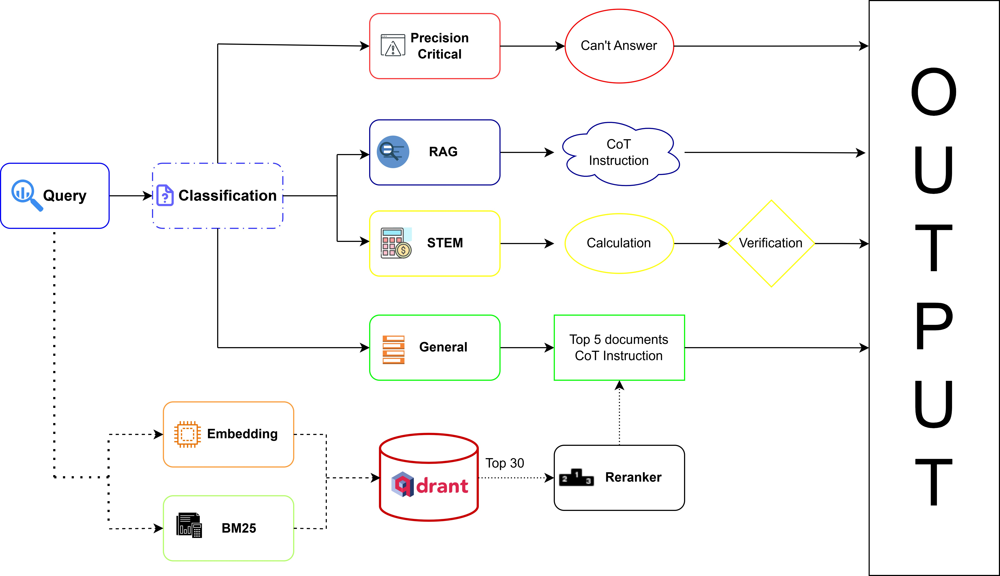

# VNPT Hackathon 2025

## Pipeline Flow (predict.py)


Hệ thống chúng tôi sử dụng kiến trúc **Adaptive Pipeline** thông minh, tự động điều hướng câu hỏi đến quy trình xử lý tối ưu nhất thay vì áp dụng RAG rập khuôn cho mọi trường hợp.

### 1. Question Classification (Adaptive Routing)
Mọi Query đầu vào (Question + Choices) được **LLM Small** phân loại thành 4 nhóm chiến lược:

*   **🛡️ Safety & Policy Filter (`cannot_answer`)**:
    *   Nhận diện các câu hỏi nhạy cảm, vi phạm chính sách hoặc độc hại.
    *   **Hành động**: Hệ thống lập tức chọn đáp án từ chối (ví dụ: "Tôi không thể trả lời...") mà không cần xử lý thêm, đảm bảo an toàn tuyệt đối.

*   **🧮 Advanced STEM Reasoning (`calculation`)**:
    *   Dành cho các câu hỏi Toán, Lý, Hóa cần tính toán chính xác.
    *   **Mô hình "Expert-Auditor"**:
        1.  **Stage 1 (The Expert - LLM Large)**: Phân tích bài toán, thiết lập công thức và giải chi tiết từng bước.
        2.  **Stage 2 (The Auditor - LLM Large)**: Đóng vai trò kiểm toán viên, kiểm tra lại logic và tính toán của chuyên gia để đảm bảo không có lỗi "ảo giác" số học, sau đó mới chốt đáp án cuối cùng.

*   **📖 Context-Aware Reading (`has_context`)**:
    *   Dành cho các câu hỏi đọc hiểu đã có sẵn đoạn văn bản dài trong đề bài.
    *   Sử dụng **LLM Large** với prompt chuyên biệt cho kỹ năng đọc hiểu, tập trung khai thác dữ kiện nội tại mà không kích hoạt RAG để tránh nhiễu thông tin bên ngoài.

*   **🌐 Adaptive RAG (`general`)**:
    *   Dành cho các câu hỏi kiến thức chung cần tra cứu thông tin bên ngoài.
    *   **Quy trình RAG nâng cao**:
        1.  **Query Expansion**: Ghép `Question + Choices` để tăng ngữ cảnh tìm kiếm.
        2.  **Hybrid Search**: Kết hợp **Dense Embedding** (VNPT API) và **Sparse Embedding** (BM25) trên Qdrant, sử dụng thuật toán **Reciprocal Rank Fusion (RRF)** để lấy Top 30 tài liệu tiềm năng.
        3.  **LLM-as-a-Judge Reranking**: Thay vì dùng Cross-Encoder thông thường, hệ thống sử dụng **LLM Small** để "chấm điểm" 30 tài liệu theo 4 tiêu chí: *Đúng chủ đề, Có từ khóa, Thông tin hữu ích, và Tính cập nhật (Freshness)*.
        4.  **Filtering**: Chỉ giữ lại tối đa **Top 5** tài liệu có điểm số > 7.0.
        5.  **Final Answer**: **LLM Large** tổng hợp thông tin từ các tài liệu chất lượng cao này để đưa ra câu trả lời cuối cùng.

> **Note**: Việc sử dụng `LLM Small` làm Reranker cho phép xử lý Context Window lớn hơn (đánh giá được 30 tài liệu cùng lúc) và linh hoạt hơn trong việc đánh giá "tính cập nhật" của thông tin so với các mô hình Rerank truyền thống. Tất cả LLMs đều sử dụng `temperature  = 0` để tránh bị Hallucinations.

## Data Processing
- Các nguồn dữ liệu và cách xử lý được để ở link: [sheet](https://docs.google.com/spreadsheets/d/176Hs2OUBhQj6UrNkRyu4dse9xK_ag_6VMZZsd2maLy8/edit?usp=sharing)
- Tổng hợp dữ liệu được để ở link: [Data](https://drive.google.com/drive/folders/1dUnodqUE3Ea0ESjACpEEGARFgtiua-KR?usp=sharing). Trong đó, folder `input` chứa các file đã được crawl xong, folder `output` chứa các file được đưa về dạng `.csv`.
- Data được crawl từ nhiều nguồn khác nhau. Sau khi crawl, data được gộp lại thành 1 file .csv có 3 cột "id", "title" và "text". Trong đó, cột "id" và "title" không quan trọng, cột "text" đóng góp trực tiếp vô vector database.
- Cuối cùng, gộp tất cả lại thành 1 file `vectorDB/data/data.csv` duy nhất.

## Vector Database work flow (High-Performance Indexing)

Chúng tôi đã xây dựng một quy trình **Asynchronous Indexing Pipeline** (`vectorDB/main_async.py`) được tối ưu hóa cao độ để xử lý lượng dữ liệu lớn một cách nhanh chóng và bền bỉ:

1.  **Hybrid Search Architecture**:
    *   Kết hợp sức mạnh của **Dense Embedding** (VNPT AI API, 1024 dim) để bắt ngữ nghĩa và **Sparse Embedding** (FastEmbed BM25) để bắt từ khóa chính xác.
    *   Cấu hình Qdrant collection với cả `vectors_config` (Cosine) và `sparse_vectors_config` (IDF), tạo tiền đề cho thuật toán Hybrid Search chính xác cao.

2.  **Parallel Async Processing (Sáng tạo & Tối ưu)**:
    *   Thay vì chạy tuần tự, hệ thống sử dụng `asyncio` để thực hiện song song hai tác vụ nặng nhất: **Gọi API Embedding** và **Tính toán BM25** cùng lúc (`asyncio.gather`).
    *   Tăng tốc độ xử lý lên gấp **5-8 lần** so với phiên bản synchronous truyền thống.

3.  **Robust API Rate Limiting & Resilience**:
    *   Thiết kế cơ chế **Semaphore** để kiểm soát chặt chẽ số lượng request đồng thời (`MAX_CONCURRENT_REQUESTS`), đảm bảo không bao giờ vượt quá giới hạn 500 req/phút của VNPT API.
    *   Tích hợp cơ chế **Exponential Backoff** thông minh: tự động chờ và thử lại khi gặp lỗi mạng hoặc 429 Too Many Requests.
    *   **Note**: Khi chạy lại từ đầu có thể comment các dòng `.sleep` để chạy nhanh hơn

4.  **Smart Resume & Deduplication**:
    *   Hệ thống tự động quét các Point ID đã tồn tại trong Qdrant trước khi chạy.
    *   Cho phép tạm dừng và tiếp tục (Resume) quá trình đánh index bất cứ lúc nào mà không cần chạy lại từ đầu, tiết kiệm chi phí API và thời gian.

5.  **Context-Aware Chunking**:
    *   Sử dụng `SentenceSplitter` của Llama-index để cắt văn bản theo ngữ nghĩa câu (`chunk_size=512`, `overlap=32`), tránh việc cắt giữa chừng làm mất ngữ cảnh.

**Cấu trúc dữ liệu lưu trữ (Payload):**
```json
{
  "id": "point_id (generated sequentially)",
  "vector": {
    "dense": [0.01, -0.02, ...], // VNPT Embedding
    "sparse": {
      "indices": [12, 50, ...],   // BM25 Indices
      "values": [0.5, 0.8, ...]   // BM25 Values
    }
  },
  "payload": {
    "doc_id": "Original Document ID",
    "title": "Document Title",
    "chunk_index": "Index of chunk in document",
    "text": "Full text content of the chunk"
  }
}
```

## Resource Initialization
### API Keys Configuration
The `api-keys.json` file contains API credentials for VNPT AI Services:

```json
[
  {
    "authorization": "Bearer <JWT_TOKEN>",
    "tokenKey": "<PUBLIC_KEY_BASE64>",
    "llmApiName": "<MODEL_NAME>",
    "tokenId": "<TOKEN_UUID>"
  }
]
```

| Field | Description |
|-------|-------------|
| `authorization` | JWT Bearer token for API authentication |
| `tokenKey` | RSA public key (Base64) for encryption |
| `llmApiName` | Model name: `LLM large`, `LLM small`, or `LLM embedings` |
| `tokenId` | Token UUID identifier |

> **Note:** Configure `api-keys.json` with valid credentials before running `predict.py` and `vectorDB/main_async.py`. This file is in the main folder.

### How to run
1. Download file `data.csv` in `data.zip` at this [drive](https://drive.google.com/drive/folders/1dUnodqUE3Ea0ESjACpEEGARFgtiua-KR?usp=sharing). Put it in folder `/vectorDB/data`
2. Install Dependencies!
```
pip install -r requirements.txt
```
3. Run the Qdrant vector database workflow:
```
cd vectorDB
python main_async.py
```
4. Ensure file `test.json` is in folder `data`. Run the workflow pipeline:
```
python main.py
```
5. `submission.csv` and `predict.json` is in folder `output`
